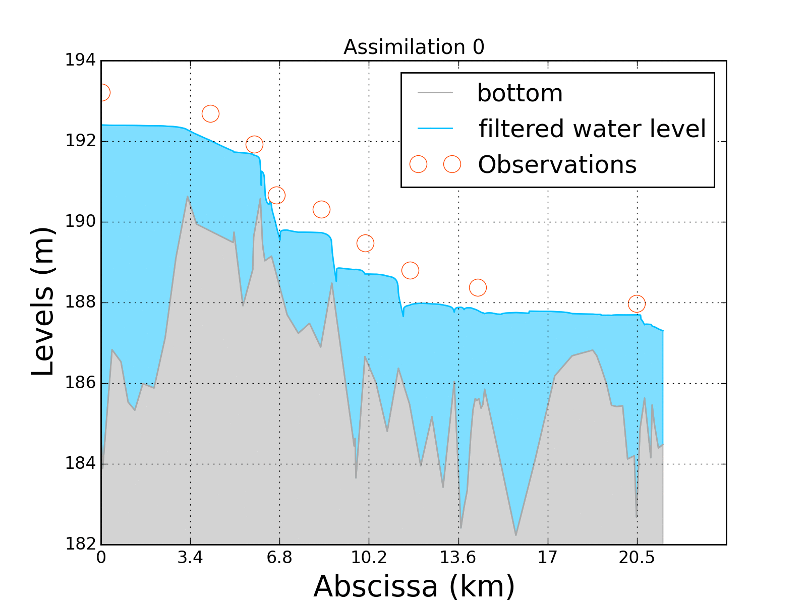

R package of the 1D shallow water code
======================================

This package is a fork of the Fortran source files available at http://opentelemac.org

Purpose: using mascaRet as a library of functions in R.

  

   <b>Data assimilation with mascaRet and R (Rhône river in France)</b>

Requirements
============

- R v3.0 or above

Use
===

library(mascaRet)

License
=======

This package is provided under the GNU GPL V3 license

References
==========

- N. Goutal, J.-M. Lacombe, F. Zaoui et K. El-Kadi-Abderrezzak, MASCARET: a 1-D Open-Source Software for Flow Hydrodynamic and Water Quality in Open Channel Networks, River Flow 2012 – Murillo (Ed.), p. 1169-1174

Contributions
=============

Contributions are always welcome ;-)

When contributing to **mascaRet** please consider discussing the changes you wish to make via the issue tab.
